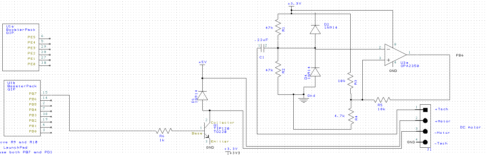
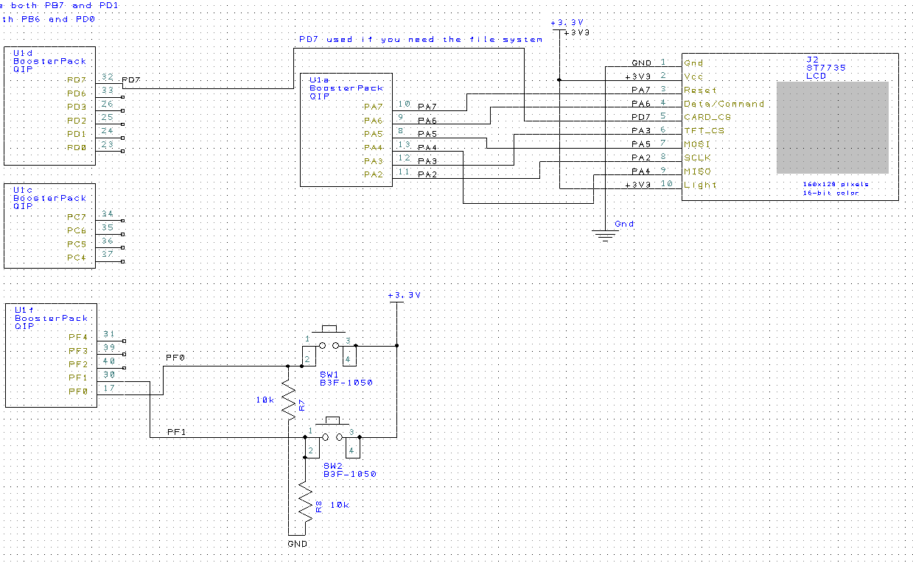
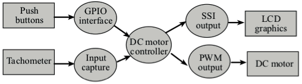
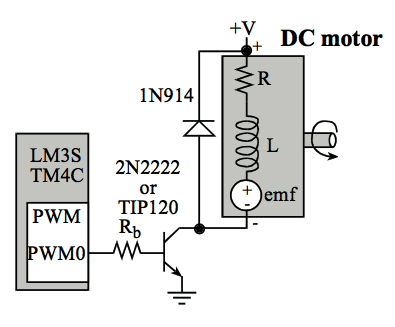

# Lab 10: DC Motor Control

## Objectives

We will spin a brushed DC motor at a constant speed using an integral controller. Two switches will allow the operator to increase or decrease the desired speed. A tachometer will be used to measure the motor speed. A background periodic interrupt will execute the three steps of a digital controller.

Additionally we will calculate error as the difference between actual and desired speed, execute a control equation to determine the next output, and adjust the power to the actuator in an attempt to drive the error to zero.

See our [requirements doc](Requirements.md).

## Hardware Design

DC Motor interface design. PB7 PWM output net shown on the left side, and PB6 tachometer input net shown on the right side.

Button and display interface design.

## Software Design

Data flows from the tachometer and from the switches to the DC motor and to the LCD.

A call graph showing the modules used by the DC motor controller.

## Measurement Data

## Analysis and Discussion

1. Torque - The tendency of a force to rotate an object about an axis, fulcrum, or pivot. Just as a force is a push or a pull, a torque can be thought of as a twist to an object. It is units of Newton-meters or N•m
2. DC motor coil diagram:

<<read section 6.5.4 in book or see https://www.dropbox.com/s/nslzri71ms6hkmu/LEC09.ppt>>

3. 

