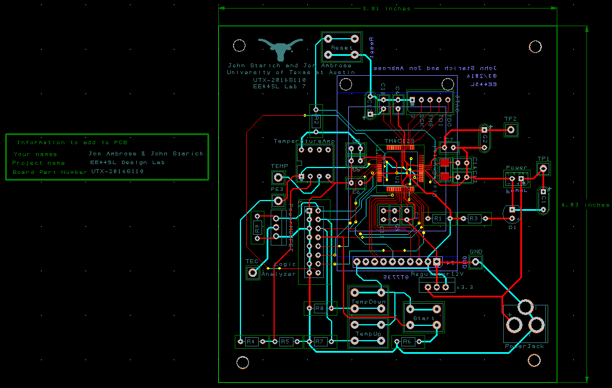
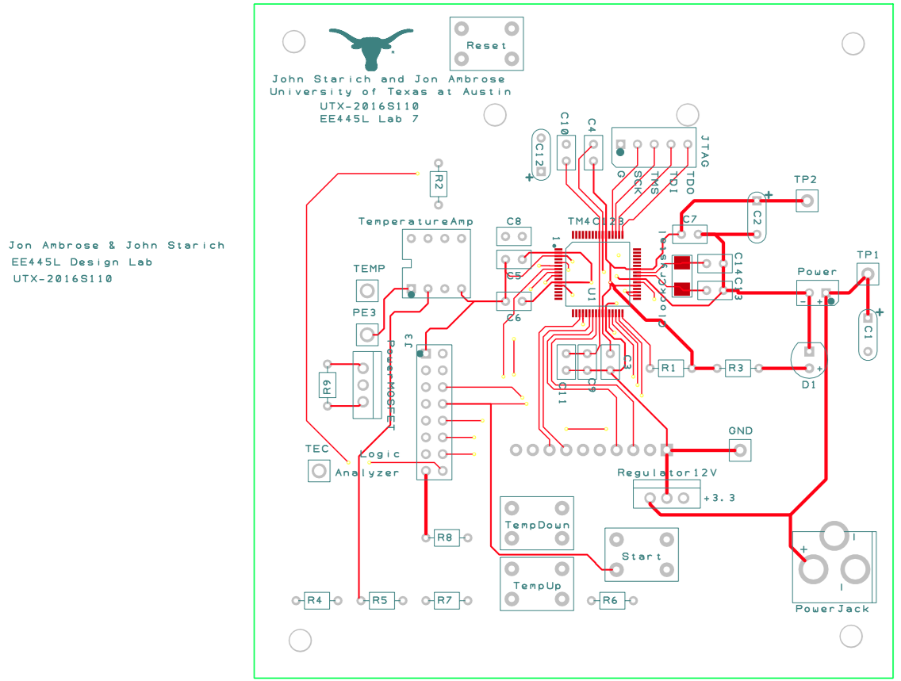
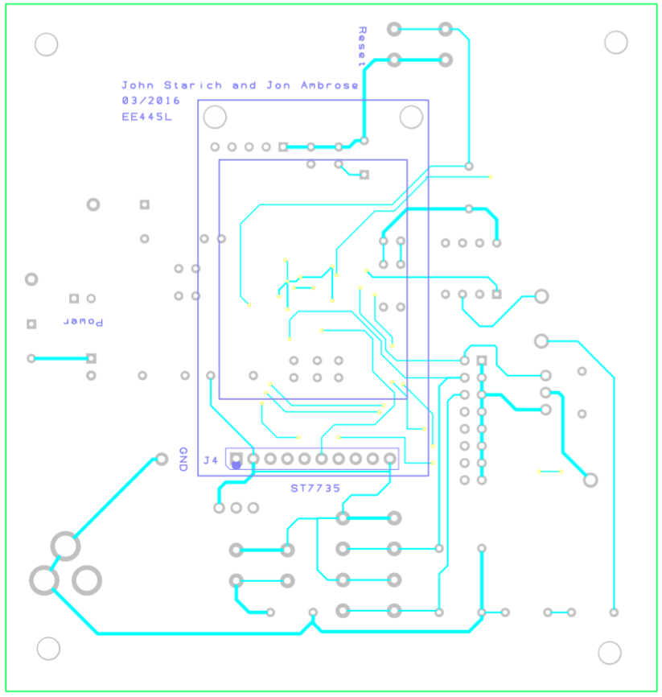

# Lab 11: Final Embedded System

## Objectives

We completed the embedded system we began in Lab 7. This lab included hardware construction, software debugging, and system evaluation.

## Hardware Design

Top Copper

Bottom Copper

## Software Design

## Measurement Data

## Video

<a href="http://www.youtube.com/watch?feature=player_embedded&v=gIcv6PLDJF4" target="_blank">
  
   
  https://youtu.be/gIcv6PLDJF4
</a>
