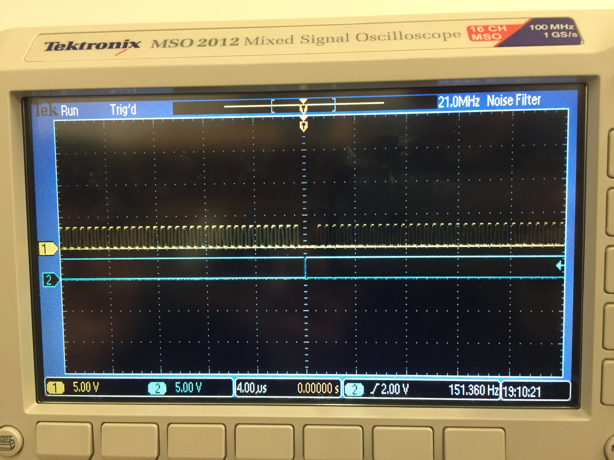
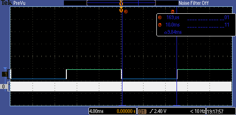
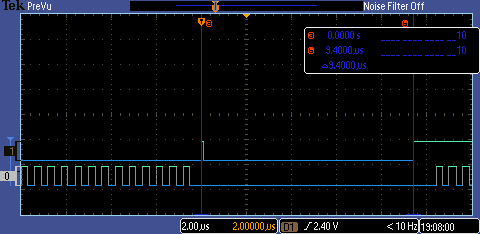
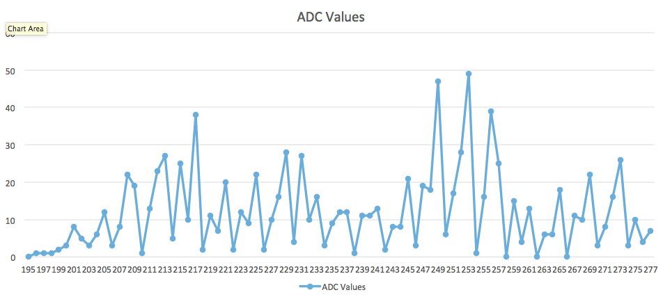
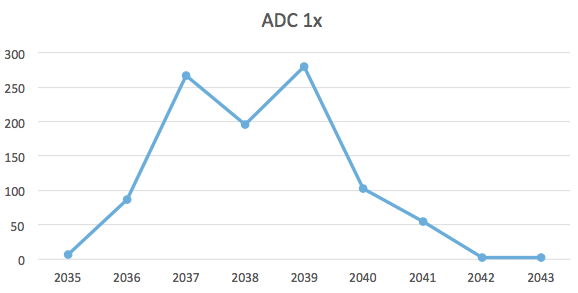
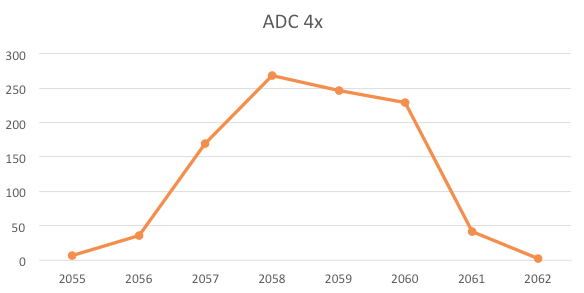
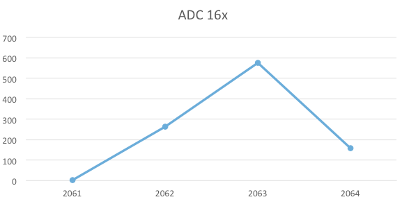
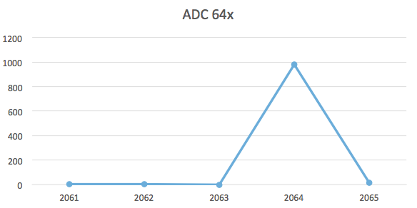

# Lab 2: Performance Debugging

## Preparation

* They hold the addresses to read and write to.
* Approximately 125 ns.
* Load one is the addresse of PF1, load two is the value of PF1.
* We could load R1 with the address of PF1 first and then load the value into R0. Then do the EOR on R0 and store back into the address in R1. This would eliminate one of the loads which was redundant.
* No, the two read/writes do not create a critical section because they use the bit specific addresses for Port F. That makes them atomic operations via the bit banding memory addressing, meaning they can't change anything other than the pin that is being written to.

## Deliverables

### Part A

Time to take one sample: 9.4 microseconds

### Part B

Time running in main: 9.84 milliseconds

Time running in the ISR: 9.4 microseconds

Percent of time main is running: 0.99895 or 99.895%

### Part C

In the lab manual's diagram 2.4, PF2 is the incorrect pin. The critical section can be seen when the ISR is triggered while the main is also toggling PF2. If both attempt to write to PF2 simultaneously, the ISR will take higher priority and flip it. However, as soon as the ISR finishes, main will overwrite that toggle with the original value again.

To fix this problem we could, assuming we don't need to keep the data on PF1 and PF2, just move one of the data pins onto a different port.

Another solution would be to require that the ISR sets a flag when it wants the value to be toggled. Then the main loop will write its toggle to the appropriate pin and if the ISR flag is set, then it will toggle again.

### Part D

Time jitter with one sampling interrupt:  71916 (or 898.95 microseconds)

Time jitter with more than one interrupt: 71942 (or 899.275 microseconds)

We see a correlation here where the more interrupts we have the larger the jitter.

### Part E

The noise appears to have spikes all over our data range with no discernable pattern. After repeated runs we have completely different data each time.

### Part F

Normal sampling rate:

4x sampling rate:

16x sampling rate:

64x sampling rate:

Clearly, hardware averaging sharpened our data into a much maller ADC value range and in more distinctive points. Noise is noticeably reduced with each successive increase in sampling.

When we increased sampling rates the time to execute the ISR took considerably longer each time. The thread profile is very different because we're in the ISR for much longer periods of time.
