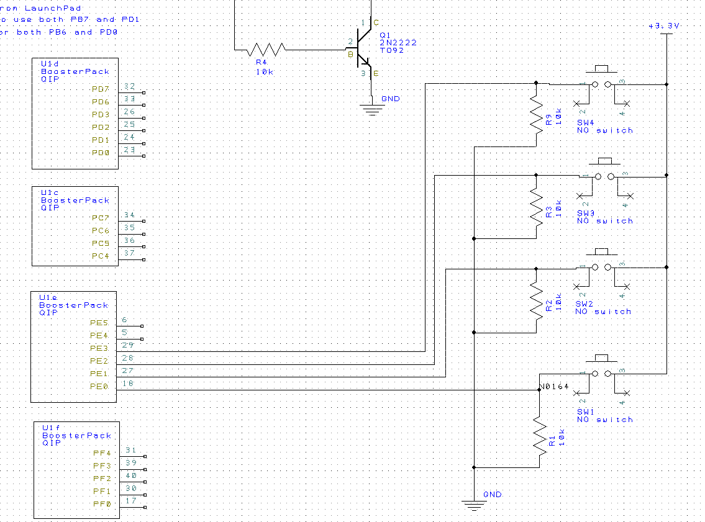
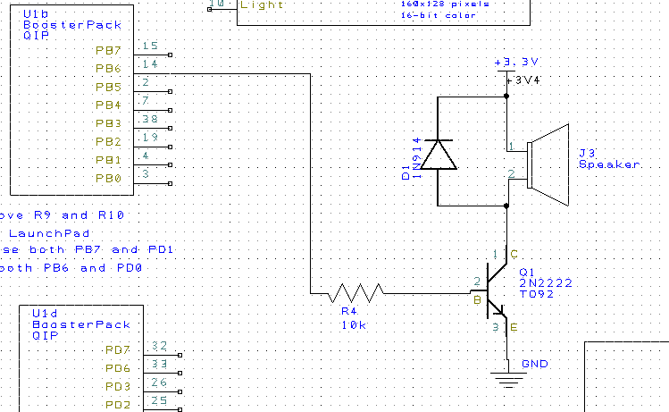
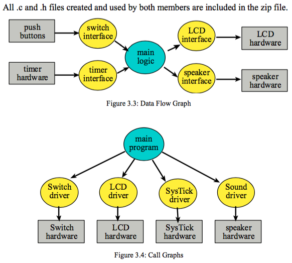
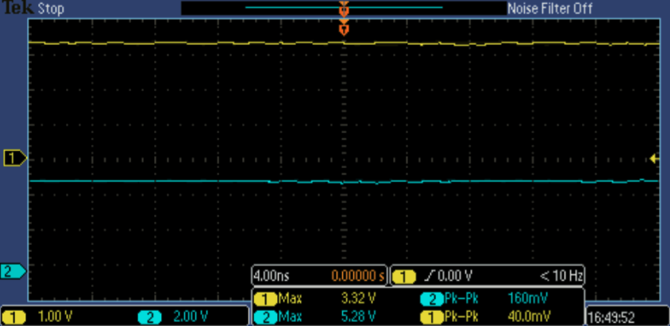
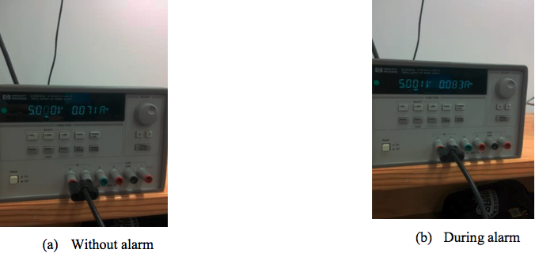

# Lab 2: Performance Debugging

## Hardware Design

## Software Design

## Measurement Data

The DC voltages on board are quite stable and within range of operating condition. The 3.3 V voltage supply on board is measured to be around 3.31V and the 5.0V supply is measured to be 5.29V. Also, the voltage ripple at 3.32V voltage supply is around 40mV peak-to-peak, which is equivalent to 28.28 mVrms for noise at that level. The voltage ripple at 5.28V voltage supply is around 160mV peak-to-peak is equivalent to 113.14 mVrms. This finding is consistent to the fact that the greater the voltage, the greater the voltage noise that exists around the voltage.

For testing purposes, the board is also run with external DC voltage supply of 5.0V and currents required to run the board are recorded. The current required for running the board without an alarm is 71mA and the current required in running with an alarm is 83mA. During alarm, only a few mA are needed to run the system because we are using a smaller ohm speaker and uses a higher resistive load between the microcontroller peripherals and the transistor.

Current readings:

## Analysis and Discussion

1. Two ways one could remove a critical section would be either to disable interrupts just long enough to write to a variable and the other way would be to remove global variables so the critical section cannot change anything in the other function/handler's stack.
2. It takes 4.3ms to update the LCD with a new time.
3. Updating the LCD in the background ISR would increase latency in the program and it would cause the system to not be a real-time system anymore. An extreme case demonstrating the need for a quick ISR is a pacemaker's pulse not being sent at the correct intervals and causing someone to have a heart attack.
4. We drew the clock face only once and only drew the clock hands when they changed.
5. If the system used battery power we could save energy by reducing our clock speed, only setting off the alarm for a shorter period of time, or updating the display less frequently.

