# Lab 5: Music Player and Audio Amp

## Objectives

See [Requirements.md](Requirements.md)

## Hardware Design

See [lab5.sch](lab5.sch)

## Software Design

We followed the design spec from the lab manual's figure 5.8 and 5.9, copied below:

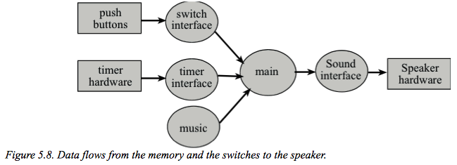

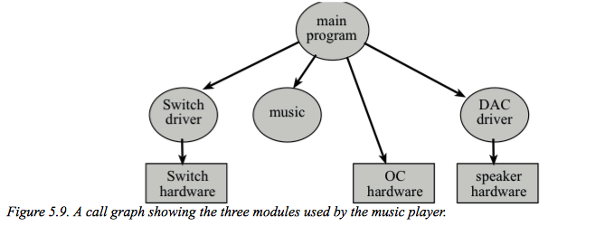

## Measurement Data

Our reference voltage is set to 2.08V.

The resolution we calculated is 1.0286 mV per increment value of our DAC. We found this using the equation: `(92mV - 56mV) / (35 - 0) = 1.0286mV`

Our maximum DAC value is 4044, by the following equation: `(2 * 2.08) V / 1.0286 mV/DAC = 4044 DAC`

The precision of our DAC is 4096. For a theoretical voltage for a DAC value of 105, we got 102.5mV using the equation: `(105 * 2 * 2) / 4096 = 102.5mV`

The actual voltage for a DAC output of 105 is 108.003mV via the equation: `1.0286 * 105 = 108.003mV`

Going by this calculation, our accuracy is 94.6%, via the equation: `1 - (108.003 - 102.5) / 102.5 = 0.9463 = 94.63%`

Here are 8 DAC output measurements:

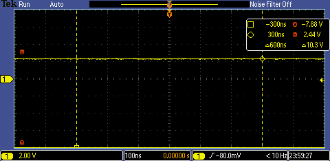

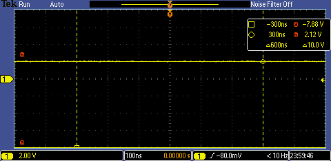

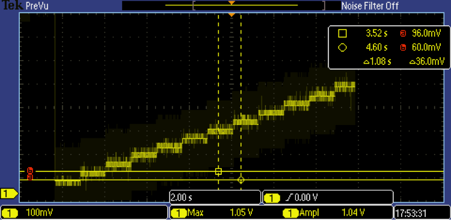

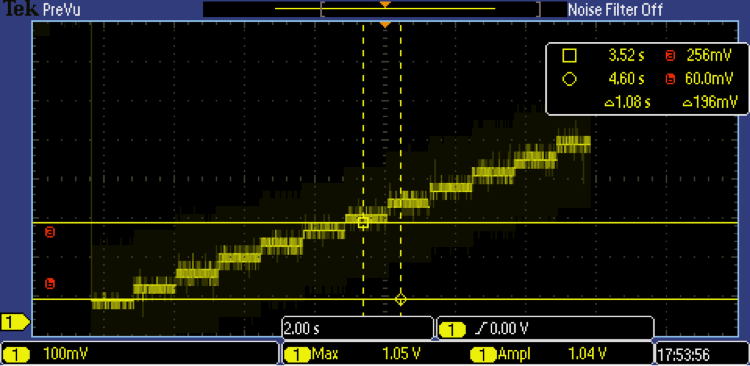

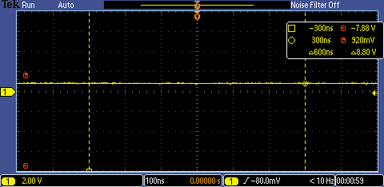

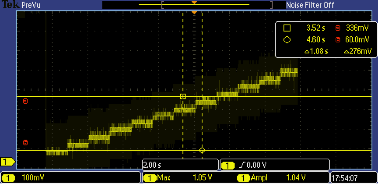

After measuring the time domain and frequency domain of our system at 425Hz, we captured the following output:

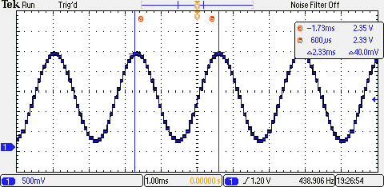

Time domain at 425Hz

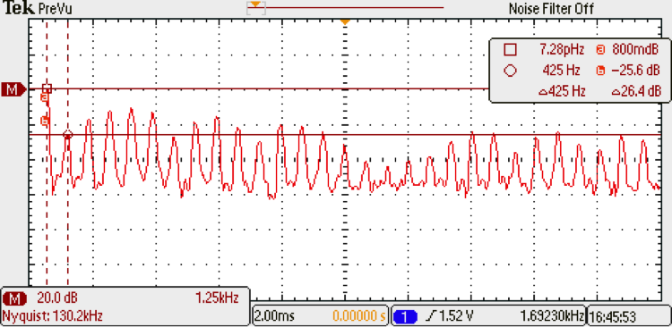

Frequency domain at 425Hz

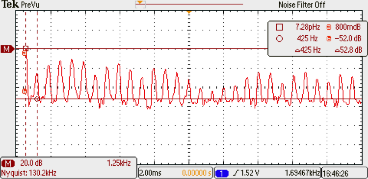

Speaker noise

Given the above output, we calculate our SNR to be 26.4dB according to this formula: `SNR = signal - noise = (-25.6dB) - (-52.0dB) = 26.4dB`

The maximum time required to execute our periodic interrupt service routine is 1 microsecond and the time between our ISR calls is about 40 microseconds. Therefore the ratio of time spent in the ISR versus the main program is `1/40 = 0.025 = 2.5%`.

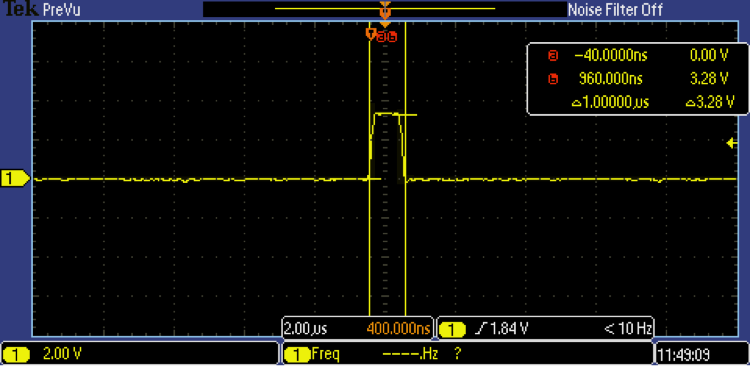

ISR max execution time = 1 microsecond

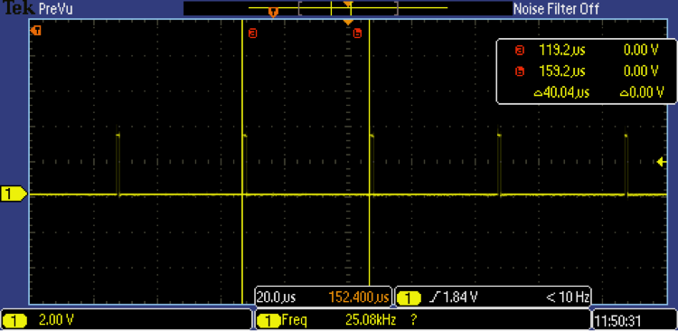

ISR to ISR time delta = 40 microseconds

We measured our current usage for our board set up to run at about 75mA without the music playing and about 96mA with it playing.

## Analysis and Discussion

1. Three possible errors on a DAC could include the following:
    - noise produced at the same frequencies as the output frequencies
    - bad resistor choices for producing the DAC increments
    - the operational amplifier could produce noise or other artifacts in the output
2. With SPH and SPO set to 0, the data available interval is 25ns. The data required interval depends on both setup time and hold time, so 13ns in total. Given that our clock speed was set to 16MHz, our clock period interval was 62.5ns. Since the smallest clock low width is 25ns, then the shortest SSI period must be `62.5 + 25 = 87.5ns`. This corresponds to a max SSI clock of 11.428MHz. We used an SSI clock of 8MHz, below that maximum.
3. Frequency range of a spectrum analyzer is determined by dividing the sampling frequency by 2 (Nyquist thm.)
4. We did not drive the speaker directly from the DAC because the current required for any decent volume is too high for the board's GPIO pins to supply. The opamp (TPA731) helps take care of the current problem by providing a current gain but a voltage decrease.
