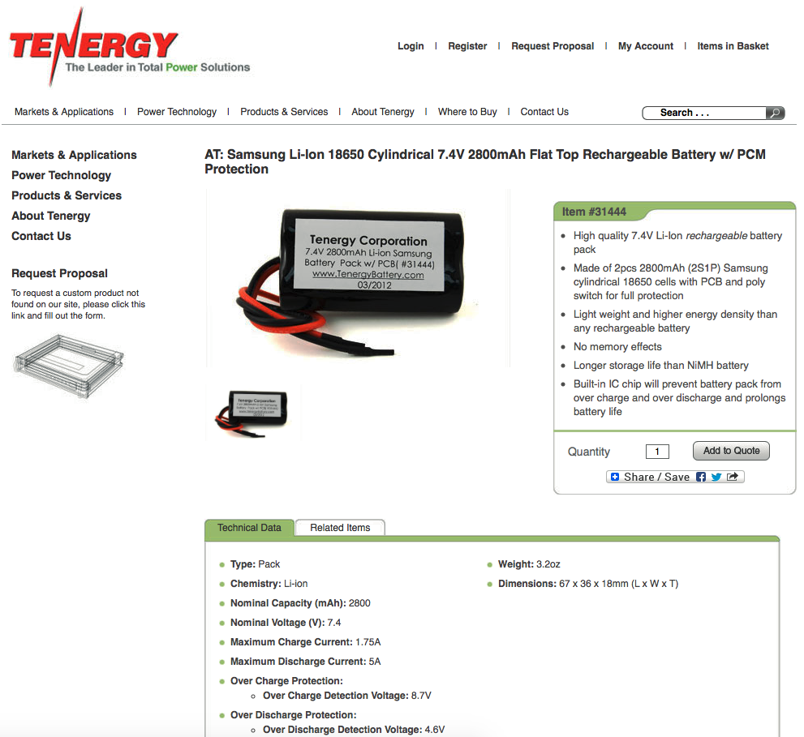
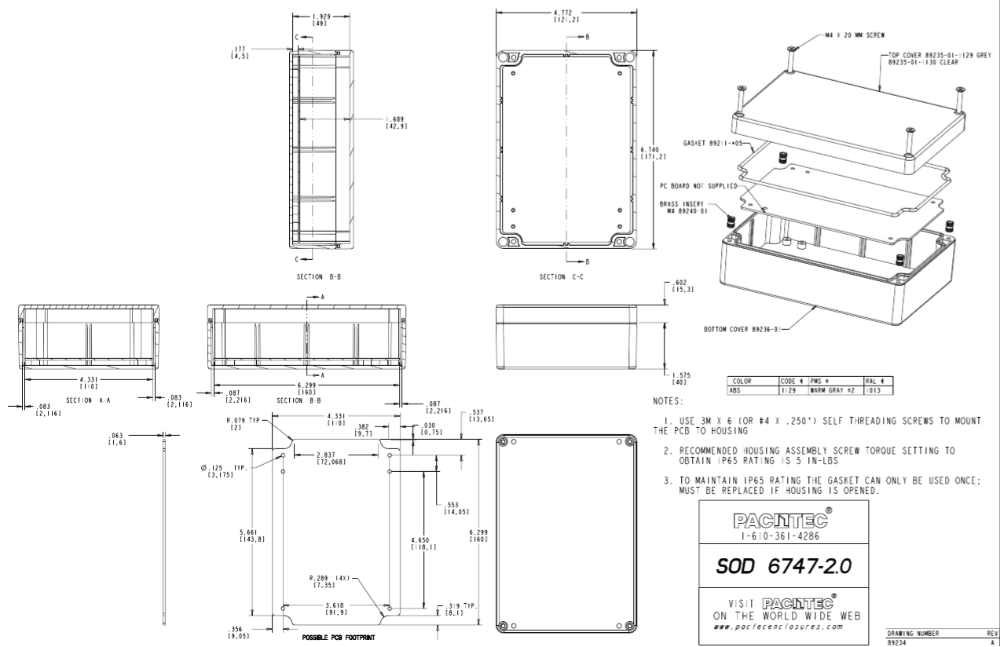

# Lab 6: Introduction to PCB Design

For this lab we will be designing and ordering a PCB version of our [Lab 3](../Lab3/README.md).

## Objectives

See our [Lab 3 requirements](Requirements.md).

## Hardware Design

We have chosen the Samsung Li-Ion 18650 Cylindrical 7.4V 2800mAh Flat Top Rechargeable Battery w/ PCM Protection as our battery for this PCB. Two of these in series should provide the proper voltage and enough current to last a while. And they're rechargeable so we can replace them with charged ones easily. We could use the following product: <http://www.tenergy.com/31444>

	
We have chosen to use a medium enclosure with enough space to house batteries. This case seems to fit the bill: <http://www.pactecenclosures.com/product-detail.php?productid=230&seriesid=38&classid=35>

### Our new component

<<<<<<<<<<<<<< insert 3-pages showing the new component we created and an example PCB using it >>>>>>>>>>>>>>

### Mechanical Drawings

<<<<<<<<<<<<<< insert 2 mechanical drawings >>>>>>>>>>>>>>

### Final Circuit Diagram

<<<<<<<<<<<<<< insert SCH screenshot(s) >>>>>>>>>>>>>>

### Mockup

<<<<<<<<<<<<<< insert cardboard mockup picture >>>>>>>>>>>>>>

## Measurement Data

### Bill of Materials

<<<<<<<<<<<<<< insert bill of materials >>>>>>>>>>>>>>

### Why this battery?

<<<<<<<<<<<<<< insert explanation for how we chose the battery to use >>>>>>>>>>>>>>

## Analysis and Discussion

<<<<<<<<<<<<<< explain our testing procedure for this system >>>>>>>>>>>>>>
