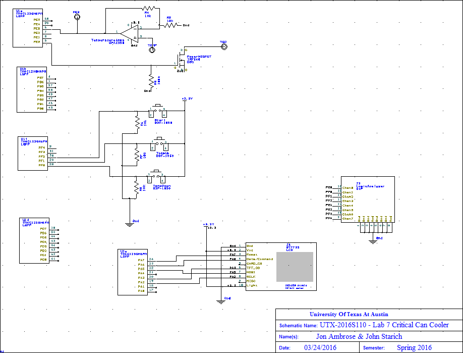
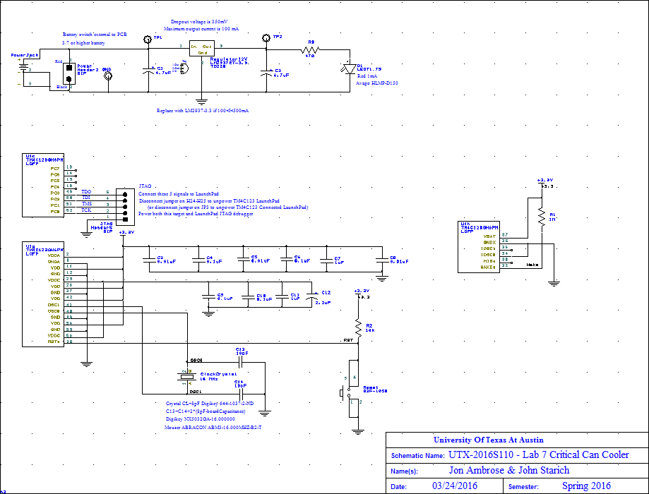
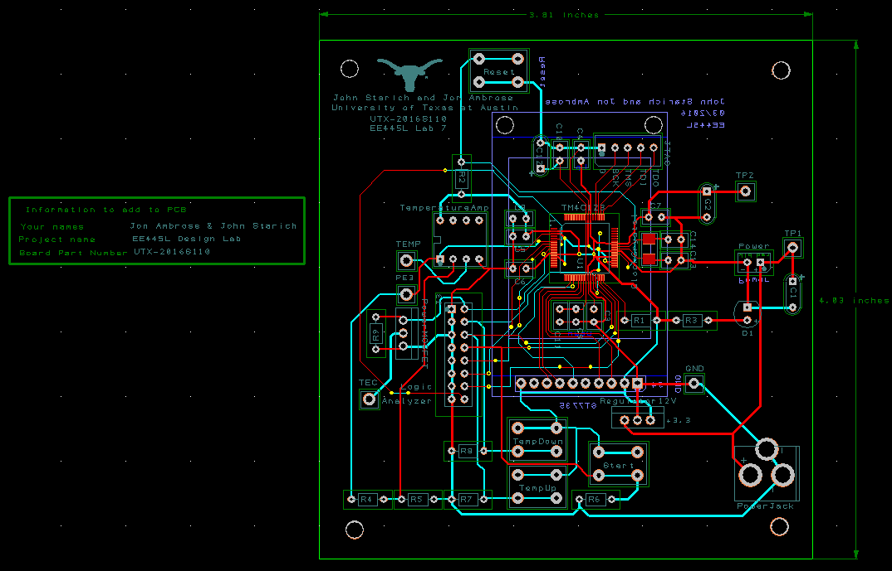
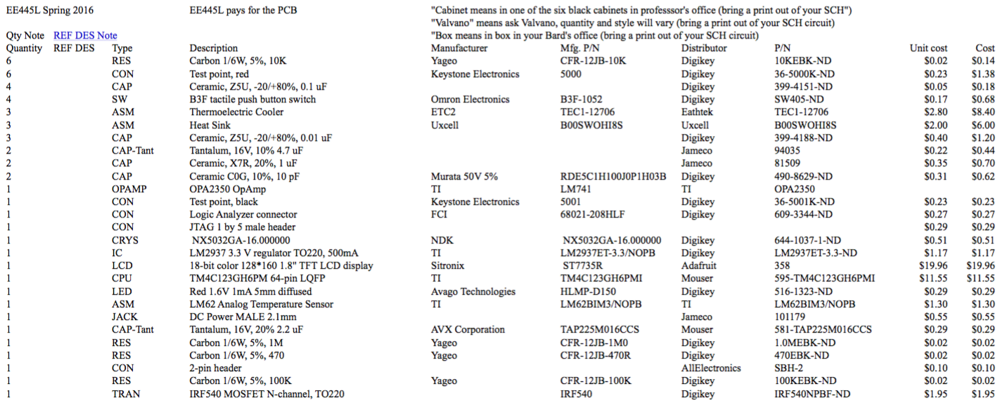
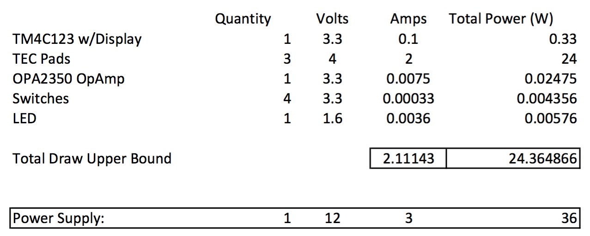
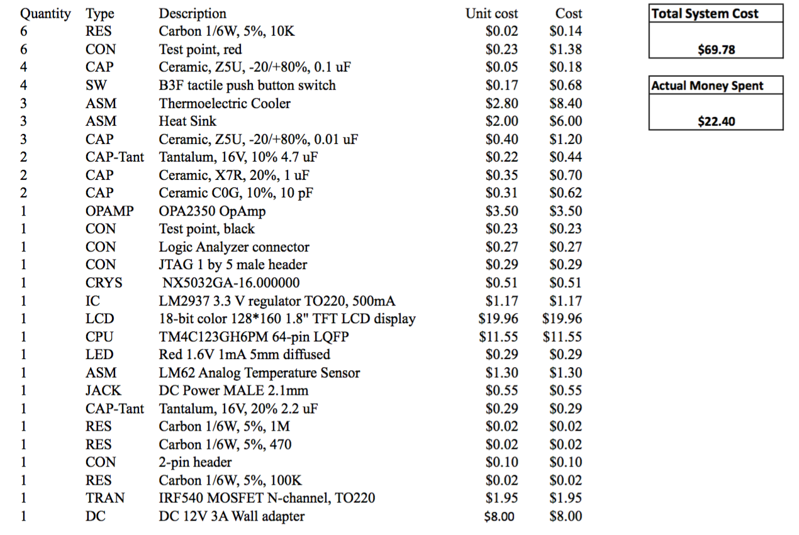

# Lab 7: Introduction to PCB Design

## Objectives

In Lab 7, we will use the CAD program PCB Artist to layout an embedded system.

## Hardware Design

Schematic

PCB Layout

## Software Design

Please see [our requirements](Requirements.md)

## Measurement Data

Power estimate

Cost estimate

Our power estimate is on sheet one. The cost estimate is on sheet two.

## Analysis and Discussion

None