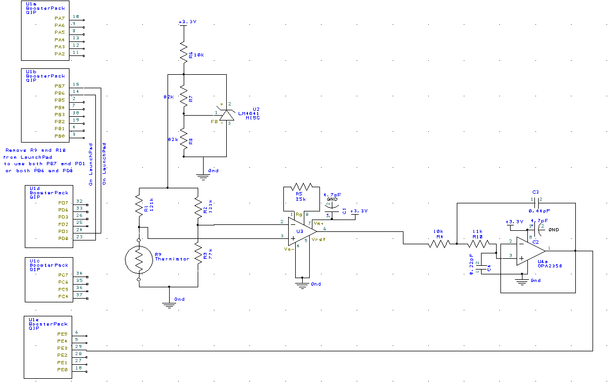

# Lab 9: Temperature Data Acquisition System

## Objectives

This experiment will use an ADC converter on the TM4C123 to construct a digital thermometer. The temperature range is 10 to 40°C. The measured temperature data will be displayed numerically as a fixed-point number on the LCD, using a 0.01 fixed-point format. The temperature versus time data will also be graphically plotted. Our temperature measurement resolution is to be 0.1°C or better. The average temperature accuracy should be 1°C or better. The frequency components of the signal are 0 to 10 Hz.

## Hardware Design



Hardware Schematic

## Software Design

### Calibration

We calibrated our resistor values for our thermistor and voltage regulator as follows:

Calibration measurements:

First point:  94.5kΩ at 25°C
Second point: 82.1kΩ at 36.03°C

R0 = 1.83kΩ

β = 1175.567

V1 = 2.47V

R1 = R2 = 121kΩ

R3 = 77kΩ

V3 = 0.961V

For INA122:

Rg = 24.51 ~= 25kΩ

Gain = 5 + 200kΩ / 25kΩ = 13.00

Range: 151 to 4045 on the ADC, 10 to 40°C

Resolution: ∆T = ~0.008°C

Our output conversion tables:

```c
uint16_t const ADCdata[53] = {
    0,151,219,288,357,427,497,567,638,709,781,                      
    853,925,998,1071,1144,1218,1292,1367,1441,1517,                        
    1593,1669,1745,1822,1899,1977,2055,2133,2212,2291,                     
    2371,2451,2531,2612,2693,2775,2857,2939,3022,3105,                     
    3189,3272,3357,3441,3527,3612,3698,3784,3871,3958,4045,4096
};

uint16_t const Tdata[53] = {
    4000,4000,3940,3880,3820,3760,3700,3640,3580,3520,3460,       
    3400,3340,3280,3220,3160,3100,3040,2980,2920,2860,     
    2800,2740,2680,2620,2560,2500,2440,2380,2320,2260,     
    2200,2140,2080,2020,1960,1900,1840,1780,1720,1660,     
    1600,1540,1480,1420,1360,1300,1240,1180,1120,1060,1000,1000
};

uint16_t const Rdata[53] = {
    7824,7824,7880,7937,7995,8054,8113,8173,8233,8294,8356,           
    8419,8482,8546,8611,8677,8743,8810,8878,8946,9016,         
    9086,9157,9229,9302,9375,9450,9525,9602,9679,9757,         
    9836,9917,9998,10080,10163,10247,10332,10419,10506,10594,          
    10684,10775,10866,10960,11054,11149,11246,11344,11443,11543,11645,11645
};
```

### Low level ADC interface

```c
int32_t fifo[FIFO_SIZE];
int32_t fifoStart = 0;
int32_t fifoEnd = 0;

void ADC0_InitTimerTriggerSeq3_Ch0(void) {
    volatile uint32_t delay;
    SYSCTL_RCGCADC_R |= 0x0001;     // activate ADC0
    SYSCTL_RCGCGPIO_R |= 0x10;      // 1) activate clock for Port E
    while((SYSCTL_PRGPIO_R&0x10) != 0x10); // wait for clock on port
    GPIO_PORTE_DIR_R &= ~0x08;      // 2) make PE3 input
    GPIO_PORTE_AFSEL_R |= 0x08;     // 3) enable alternate function on PE3
    GPIO_PORTE_DEN_R &= ~0x08;      // 4) disable digital I/O on PE3
    GPIO_PORTE_AMSEL_R |= 0x08;     // 5) enable analog functionality on PE3

    ADC0_PC_R &= ~0xF;              // 7) clear max sample rate field
    ADC0_PC_R |= 0x1;               //    configure for 125K samples/sec
    ADC0_SSPRI_R = 0x0123;          // 8) Sequencer 3 is highest priority

    // timer setup
    SYSCTL_RCGCTIMER_R |= 0x01;     // enable timer0
    delay = SYSCTL_RCGCGPIO_R;      // delay
    TIMER0_CTL_R = 0x0;             // disable timer
    TIMER0_CTL_R |= 0x020;          // enable timer0 to trigger ADC
    TIMER0_CFG_R = 0;               // configure for 32-bit timer mode
    TIMER0_TAMR_R = 0x02;           // configure for periodic mode
    TIMER0_TAPR_R = 0;              // prescale value for trigger
    TIMER0_TAILR_R = 0x1387F;       // reload time (period)
    TIMER0_IMR_R = 0x0;             // disable all interrupts
    TIMER0_CTL_R |= 0x01;           // enable timer0A 32-b, periodic

    ADC0_ACTSS_R &= ~0x0008;        // 9) disable sample sequencer 3
    ADC0_EMUX_R = (ADC0_EMUX_R & ~0x0F000) | 0x05000;  // 10) seq3 is software trigger
    ADC0_SSMUX3_R &= ~0x000F;       // 11) clear SS3 field
    //ADC0_SSMUX3_R += 0;           // set channel to 0
    ADC0_SSCTL3_R = 0x0006;         // 12) no TS0 D0, yes IE0 END0
    ADC0_IM_R |= 0x0008;                      // 13) disable SS3 interrupts
    ADC0_SAC_R |= 0x6;              // enable x64 sampling
    ADC0_ACTSS_R |= 0x0008;         // 14) enable sample sequencer 3
    
    NVIC_PRI4_R = (NVIC_PRI4_R & ~0x0FF00) | 0x04000; // timer0 priority 2
    NVIC_EN0_R = 1 << 17;           // enable interrupt 17 in NVIC
    
    // "zero" out with bad data (-1)
    for(int i = 0; i < FIFO_SIZE; i += 1) {
        fifo[i] = -1;
    }
}

void ADC_FIFO_Push(int32_t data) {
    int32_t nextFifoEnd = (fifoEnd + 1) % FIFO_SIZE;
    if(nextFifoEnd == fifoStart) {
        return;
    }
    fifoEnd = nextFifoEnd;
    fifo[fifoEnd] = data;
}

int32_t ADC_FIFO_Pop(void) {
    if(fifoStart == fifoEnd) {
        return -1;
    }
    int32_t poppedValue = fifo[fifoStart];
    fifoStart = (fifoStart + 1) % FIFO_SIZE;
    return poppedValue;
}

void ADC0Seq3_Handler(void){
    ADC0_ISC_R = 0x0008;
    uint32_t result = ADC0_SSFIFO3_R&0xFFF;
    if((fifoStart + 1) % FIFO_SIZE == fifoEnd) {
        ADC_FIFO_Pop();
    }
    ADC_FIFO_Push(result);
}

int32_t* ADC_FIFO_Get(void) { return fifo; }

int32_t ADC_FIFO_CurrentValue(void) { return fifo[fifoStart]; }
```

### Main program

```c
int main(void) {
    DisableInterrupts();
    PLL_Init(Bus80MHz); // bus clock at 80 MHz
    UART_Init();
    ST7735_InitR(INITR_REDTAB);
    ADC0_InitTimerTriggerSeq3_Ch0();

    EnableInterrupts();

    while(1) {
        ST7735_SetCursor(0, 0);
        int32_t currentTemperature = Temperature_Convert(ADC_FIFO_CurrentValue());
        printf("Temperature %5d.%02d\n", currentTemperature / 100, currentTemperature % 100);
        ST7735_PlotClear(32, 159);
        
        for(int i = 0; i < FIFO_SIZE; i += 1) {
            int32_t point = 128 - Temperature_Convert(ADC_FIFO_Get()[i]) * 2 / 100;
            ST7735_DrawPixel(i+1, point+1, ST7735_RED);
            ST7735_DrawPixel(i+1, point, ST7735_RED);
            ST7735_DrawPixel(i, point+1, ST7735_RED);
            ST7735_DrawPixel(i, point, ST7735_RED);
        }
        WaitForInterrupt();
    }
}
```

## Measurement Data


## Analysis and Discussion

1. .
2. .
3. .
4. .
5. .
6. .
